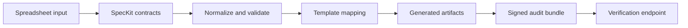

# Architecture Pack

## System Boundary

This repository models local-first document automation for spreadsheet cleanup and template mapping. The system is designed to run without external services, while preserving auditability through signed exports and structured events.

## Architecture Notes



The key design choice is separating data contracts, template mapping, and export signing. That makes each stage independently testable.

## Demo Path

```bash
make install
make sample-data
python scripts/exercise_runtime_scorecard.py
pytest -q
```

Useful entry points:

- `app/main.py`
- `app/services/excel_processor.py`
- `app/services/template_engine.py`
- `app/services/export_service.py`
- `tests/test_critical_paths.py`

## Validation Evidence

- Tests cover auth, settings, export signatures, path restrictions, template mapping, and UI route contracts.
- `docs/offline-deploy.md` describes offline install posture.
- Signed export verification provides a replayable evidence path.

## Threat Model

| Risk | Control |
|---|---|
| Path traversal | allowed base directory checks |
| Untrusted template drift | placeholder/spec mismatch preview |
| Audit tampering | HMAC-signed bundles |
| Credential leakage | local configuration and secret scanning |

## Maintenance Notes

- Treat sample spreadsheets as public fixtures.
- Keep export verification backwards-compatible.
- Add a regression test for every new template rule.
- Preserve offline mode as a first-class path.
