# Revenue Architecture - secure-xl2hwp-local

This document turns the repository architecture into a zero-to-low-cost service path. It is not a revenue guarantee; it defines the product boundary, free-tier launch stack, metering hooks, and upgrade path needed to test willingness to pay before taking on fixed infrastructure cost.

## Productized Offer

| Layer | Decision |
| --- | --- |
| Target buyer / user | regulated office, local government team, or enterprise back office needing offline spreadsheet-to-document automation |
| Productized offer | local-only spreadsheet cleanup and Hancom handoff workflow with signed audit/export evidence |
| First paid SKU | fixed-scope customer-owned pilot for one approved Excel-to-Hancom workflow |
| Free lead magnet | public architecture page that explains trust boundary and handoff path |
| Paid expansion | additional approved templates, customer connector work, and support only after the first workflow passes acceptance |
| Data / workflow moat | template drift reports, signed audit bundles, offline deployment recipe, and regulated workflow templates |
| Private inquiry | https://kim3310-doeon-kim-portfolio.pages.dev/?offer=secure-xl2hwp-local&inquiry=secure-workflow-pilot#private-inquiry |

## Low-Cost Launch Stack

| Concern | Default choice |
| --- | --- |
| Build and coding loop | OpenCode, Kimi Code CLI, Freebuff, Lovable, Ollama-assisted local agents |
| Public front door | Cloudflare Pages first, with Vercel/Netlify as alternate static front doors |
| Lead intake | Central Cloudflare private inquiry form for business contact and scope only; never customer documents or credentials |
| AI inference | Customer-owned Ollama by default; external providers require a separate approved data-boundary decision |
| Storage / exports | Customer persistent filesystem for input, output, audit logs, and signed bundles |
| Repo-specific launch path | Cloudflare Pages documentation, customer-owned single-process FastAPI runtime, and no vendor-hosted regulated data path |

Keep public infrastructure separate from the document runtime. The central intake records only enough contact and scope information to qualify a pilot; the customer runtime retains all documents, secrets, outputs, and audit evidence.

## System Shape

```mermaid
flowchart LR
  Visitor["Visitor or operator"] --> Demo["Free public demo / docs"]
  Demo --> Capture["Lead capture or anonymous workspace"]
  Capture --> Scope["Private scope review"]
  Scope --> Pilot["Customer-owned secure workflow pilot"]
  Pilot --> Core["One approved Excel-to-Hancom workflow"]
  Core --> Export["Signed output and audit evidence"]
  Export --> Accept["Customer acceptance report"]
  Accept --> Expand["Additional templates or support"]
```

## Commercial Boundary

- Free: public architecture, synthetic walkthrough, and verification instructions.
- Paid: one approved workflow, template adaptation, customer-owned deployment profile, boundary acceptance checks, signed export evidence, and an operator runbook.
- Excluded: vendor-hosted documents, multi-worker runtime, SSO/OIDC, shared rate-limit state, compliance certification, and production SLA.
- Expansion is offered only after measured pilot acceptance, not as an unverified per-seat license.

## 30-Day Revenue Test

1. Keep one CTA to the private `secure-workflow-pilot` intake.
2. Qualify one workflow, one template family, named operators, data sensitivity, and the required customer perimeter.
3. Agree on a measurable baseline and acceptance target.
4. Run synthetic data first, then approved customer data only after the runtime gate passes.
5. Deliver the signed verification pack, operator runbook, and production gap report.
6. Track qualified inquiries, scoped pilots, acceptance rate, time saved, correction reduction, and expansion decisions.

## Cost Guardrails

- Keep the public surface static and the inquiry payload small.
- Keep synthetic sample data in public artifacts.
- Do not upload customer documents or audit bundles to the public intake.
- Use customer-owned compute, storage, secrets, and model runtime for the pilot.
- Do not build checkout or subscription machinery before a fixed-scope pilot converts.

## Paid Conversion Architecture

The paid motion is an implementation and acceptance package, not a hosted tier. Expansion may add approved templates, connector work, customer identity integration, centralized audit state, or support, but each addition requires a separately scoped boundary and acceptance gate.
